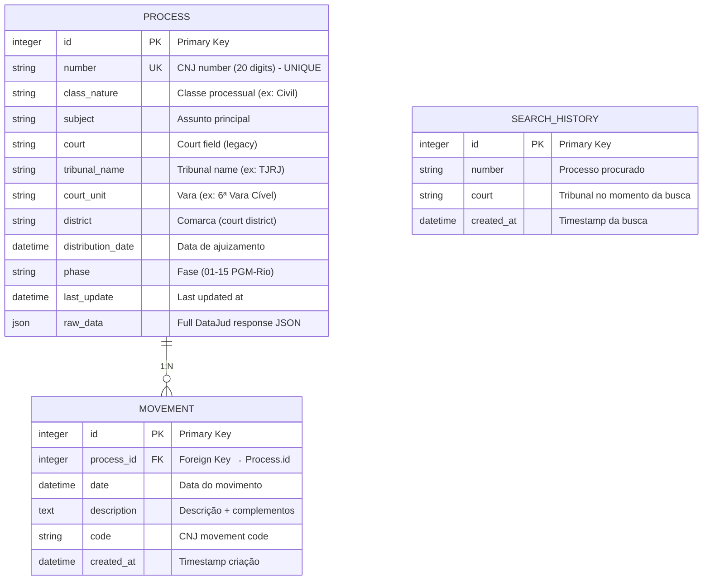

# Database Schema Documentation

**Projeto:** Consulta Processo
**Database:** SQLite 3 (local file-based)
**Data:** 2026-02-21
**Auditor:** @data-engineer (Dara)
**Fase:** Brownfield Discovery - Fase 2

---

## 1. Executive Summary

O "Consulta Processo" utiliza **SQLite 3** com schema simples e direto: **3 tabelas**, **1:N relationship**, **sem views/triggers/functions**. O design é adequado para desenvolvimento local e cargas pequenas (<5k requests/day), mas apresenta **limitações críticas para produção** (single-writer concurrency model).

### 1.1 Schema Overview

| Aspecto | Implementação |
|---------|---------------|
| **Tabelas** | 3 (Process, Movement, SearchHistory) |
| **Relacionamentos** | 1 (Process 1:N Movement) |
| **Indexes** | 3 (Process.number UNIQUE, Process.tribunal_name, SearchHistory.number) |
| **Foreign Keys** | 1 (Movement.process_id → Process.id) |
| **Cascade Deletes** | Sim (Movement cascade delete com Process) |
| **Row-Level Locking** | Sim (SELECT FOR UPDATE implementado) |
| **Transactions** | Implementado com context manager |
| **Triggers** | Nenhum (criado manualmente em código) |
| **Constraints** | Básicos (NOT NULL, UNIQUE, FK) |

### 1.2 Data Volume Expectations

```
Process table:  ~5,000-50,000 rows (depends on bulk searches)
Movement table: ~50,000-500,000 rows (avg 10 movements per process)
SearchHistory:  ~10,000-100,000 rows (audit log)

Estimated DB size: 50MB-500MB (JSON raw_data field)
```

---

## 2. Entity Relationship Diagram (ERD)



---

## 3. Detailed Table Definitions

### 3.1 Table: `processes`

**Purpose:** Core entity representing a CNJ process

**DDL:**
```sql
CREATE TABLE processes (
    id INTEGER PRIMARY KEY AUTOINCREMENT,
    number TEXT NOT NULL UNIQUE,
    class_nature TEXT,
    subject TEXT,
    court TEXT,
    tribunal_name TEXT,
    court_unit TEXT,
    district TEXT,
    distribution_date DATETIME,
    phase TEXT,
    last_update DATETIME DEFAULT CURRENT_TIMESTAMP,
    raw_data JSON
);

CREATE INDEX idx_process_number ON processes(number);
CREATE INDEX idx_process_tribunal ON processes(tribunal_name);
```

**Columns:**

| Column | Type | Constraints | Purpose |
|--------|------|-----------|---------|
| `id` | INTEGER | PK, AUTOINCREMENT | Unique row identifier |
| `number` | TEXT | NOT NULL, UNIQUE, INDEX | CNJ process number (20 dígitos) - Lookup key |
| `class_nature` | TEXT | NULL | Classe processual (Civil, Criminal, etc.) |
| `subject` | TEXT | NULL | Assunto processual principal |
| `court` | TEXT | NULL | Legacy court field (denormalized) |
| `tribunal_name` | TEXT | NULL, INDEX | Tribunal name (TJRJ, TJSP, etc.) |
| `court_unit` | TEXT | NULL | Vara/Juizado (ex: 6ª Vara Cível) |
| `district` | TEXT | NULL | Comarca (court district code) |
| `distribution_date` | DATETIME | NULL | Data de ajuizamento (when filed) |
| `phase` | TEXT | NULL | Current phase (01-15, PGM-Rio classification) |
| `last_update` | DATETIME | DEFAULT now() | Last modification timestamp |
| `raw_data` | JSON | NULL | Full DataJud API response (for audit/future use) |

**Access Patterns:**
- GET by `number` (PRIMARY - unique lookup)
- GET by `tribunal_name` (SECONDARY - filter by court)
- UPDATE `phase` + `last_update` (frequent via ProcessService)
- DELETE cascade (rare, full cleanup)

**Indexes Present:**
- ✅ `idx_process_number` (UNIQUE INDEX on `number`)
- ✅ `idx_process_tribunal` (INDEX on `tribunal_name`)

**Indexes Missing:** None (adequate for current access patterns)

---

### 3.2 Table: `movements`

**Purpose:** Audit trail of process movements (timeline of legal events)

**DDL:**
```sql
CREATE TABLE movements (
    id INTEGER PRIMARY KEY AUTOINCREMENT,
    process_id INTEGER NOT NULL,
    date DATETIME NOT NULL,
    description TEXT NOT NULL,
    code TEXT,
    created_at DATETIME DEFAULT CURRENT_TIMESTAMP,
    FOREIGN KEY(process_id) REFERENCES processes(id) ON DELETE CASCADE
);

-- ⚠️ MISSING INDEXES - See DB-AUDIT.md
```

**Columns:**

| Column | Type | Constraints | Purpose |
|--------|------|-----------|---------|
| `id` | INTEGER | PK, AUTOINCREMENT | Unique row identifier |
| `process_id` | INTEGER | NOT NULL, FK | Reference to parent Process |
| `date` | DATETIME | NOT NULL | When the movement occurred |
| `description` | TEXT | NOT NULL | Movement description + complements |
| `code` | TEXT | NULL | CNJ movement code (for normalization) |
| `created_at` | DATETIME | DEFAULT now() | When record was inserted |

**Access Patterns:**
- GET by `process_id` (PRIMARY - list all movements for process)
- GET by `date` range (SECONDARY - timeline queries)
- INSERT new movements (frequent, bulk)
- DELETE via CASCADE (rare, with parent Process)

**Indexes Present:** None ⚠️

**Indexes Missing:** ⚠️ **HIGH PRIORITY**
- `idx_movement_process_id` (Foreign key query performance)
- `idx_movement_date` (Date range queries)
- `idx_movement_code` (Code-based searches)

---

### 3.3 Table: `search_history`

**Purpose:** Audit log of all process searches (for analytics + user tracking)

**DDL:**
```sql
CREATE TABLE search_history (
    id INTEGER PRIMARY KEY AUTOINCREMENT,
    number TEXT NOT NULL,
    court TEXT,
    created_at DATETIME DEFAULT CURRENT_TIMESTAMP
);

CREATE INDEX idx_search_number ON search_history(number);
```

**Columns:**

| Column | Type | Constraints | Purpose |
|--------|------|-----------|---------|
| `id` | INTEGER | PK, AUTOINCREMENT | Unique row identifier |
| `number` | TEXT | NOT NULL, INDEX | CNJ process number searched |
| `court` | TEXT | NULL | Court at search time |
| `created_at` | DATETIME | DEFAULT now() | When search was performed |

**Access Patterns:**
- INSERT new search (frequent)
- GET by `number` (analytics queries)
- SELECT all (dashboard stats)

**Indexes Present:**
- ✅ `idx_search_number` (INDEX on `number`)

**Indexes Missing:** None (adequate for audit log use case)

---

## 4. Relationships & Integrity

### 4.1 Primary Relationship: Process 1:N Movement

**Type:** One-to-Many (1:N)

**Foreign Key:**
```sql
FOREIGN KEY(process_id) REFERENCES processes(id) ON DELETE CASCADE
```

**Semantics:**
- 1 Process has N Movements (timeline of legal events)
- When Process is deleted, all associated Movements are automatically deleted (CASCADE)
- Movements cannot exist without parent Process (NOT NULL constraint)

**Integrity Guarantees:**
- ✅ FK constraint enforced (SQLite)
- ✅ Cascade delete implemented (automatic cleanup)
- ✅ Row-level locking (SELECT FOR UPDATE in ProcessService)

### 4.2 Non-Enforced Relationship: SearchHistory → Process

**Type:** Logical (not enforced via FK)

**Current Implementation:**
```python
# backend/services/process_service.py
search_history = SearchHistory(number=number, court=court)
db.add(search_history)
```

**Issue:** ⚠️ No foreign key constraint between SearchHistory.number and Process.number
- SearchHistory can reference non-existent processes
- No automatic cleanup if Process is deleted

**Status:** Design choice (audit log independence), but increases orphan risk

---

## 5. Constraints & Validation

### 5.1 NOT NULL Constraints

| Table | Column | Reason |
|-------|--------|--------|
| Process | `number` | Required - primary lookup key |
| Movement | `process_id` | Required - referential integrity |
| Movement | `date` | Required - event timestamp |
| Movement | `description` | Required - event details |
| SearchHistory | `number` | Required - audit log |

### 5.2 UNIQUE Constraints

| Table | Column(s) | Purpose |
|-------|-----------|---------|
| Process | `number` | Ensure no duplicate CNJ process numbers |

### 5.3 CHECK Constraints

**Current:** None

**Recommended (not implemented):**
```sql
-- Validate CNJ number format (20 digits)
ALTER TABLE processes ADD CHECK (LENGTH(number) = 20 AND number GLOB '[0-9]*');

-- Validate phase range (01-15)
ALTER TABLE processes ADD CHECK (phase IS NULL OR phase BETWEEN '01' AND '15');
```

---

## 6. Indexing Strategy

### 6.1 Current Indexes (3 total)

| Index Name | Table | Column(s) | Type | Purpose | Performance |
|------------|-------|-----------|------|---------|-------------|
| `sqlite_autoindex_1` | Process | `number` | UNIQUE | PK lookup | ✅ Optimal |
| `idx_process_tribunal` | Process | `tribunal_name` | BTREE | Filter by court | ✅ Good |
| `idx_search_number` | SearchHistory | `number` | BTREE | Audit queries | ✅ Good |

### 6.2 Missing Indexes (HIGH PRIORITY) ⚠️

| Table | Column(s) | Type | Impact | Query Examples |
|-------|-----------|------|--------|-----------------|
| Movement | `(process_id, date DESC)` | COMPOSITE | **HIGH** | SELECT movements WHERE process_id = ? ORDER BY date DESC |
| Movement | `code` | BTREE | MEDIUM | SELECT movements WHERE code = ? (classification rules) |
| Process | `phase` | BTREE | MEDIUM | SELECT processes WHERE phase = '01' (analytics) |

### 6.3 Index Statistics

```sql
-- Estimated index sizes (SQLite defaults):
- idx_process_number: ~100 KB (5k rows × 20 bytes)
- idx_process_tribunal: ~150 KB (5k rows, variable length)
- idx_search_number: ~50 KB (10k rows)
- MISSING idx_movement_process_date: ~500 KB (50k rows, composite)

Total current: ~300 KB
After adding recommended: ~800 KB (acceptable)
```

---

## 7. Transaction Management

### 7.1 Current Implementation

**Context Manager Pattern:**
```python
# backend/database.py
@contextmanager
def transaction_scope(db: Session):
    try:
        yield db
        db.commit()  # Auto-commit on success
    except IntegrityError as e:
        db.rollback()
        raise
    except Exception as e:
        db.rollback()
        raise
```

**Usage in ProcessService:**
```python
with transaction_scope(self.db):
    process = self.db.query(Process).with_for_update().first()  # Row-level lock
    # ... UPSERT operations
    # Auto-commits if no exception
```

### 7.2 Row-Level Locking

**Implementation:** SQLite `SELECT FOR UPDATE`

```python
process = (
    db.query(Process)
    .filter(Process.number == number)
    .with_for_update()  # Acquires write lock
    .first()
)
```

**Guarantee:** Prevents race conditions in bulk operations (concurrent updates to same process)

**Limitation:** SQLite single-writer limitation (see DB-AUDIT.md)

### 7.3 Isolation Level

**Default:** SQLite SERIALIZABLE (most strict)

**Characteristics:**
- ✅ Prevents phantom reads
- ✅ Prevents dirty reads
- ✅ Prevents lost updates
- ⚠️ Can cause contention with concurrent writes

---

## 8. Data Storage & Optimization

### 8.1 Raw JSON Storage

**Field:** `Process.raw_data`

**Purpose:** Store complete DataJud API response for:
- Audit trail (compare to extracted fields)
- Future re-parsing (if classification rules change)
- Data recovery (reconstruct if processing fails)

**Size Impact:**
```
Avg JSON per process: 5-20 KB (depends on movement count)
With 5k processes: 25-100 MB (significant portion of DB)
```

**Optimization Recommendation:** Consider compression or archival (see DB-AUDIT.md)

### 8.2 Type Mapping (SQLAlchemy → SQLite)

| Python | SQLAlchemy | SQLite | Notes |
|--------|-----------|--------|-------|
| int | Integer | INTEGER | Auto-increment with ROWID |
| str | String | TEXT | Variable length, no size limit |
| datetime | DateTime(timezone=True) | DATETIME | Stored as TEXT (ISO 8601 format) |
| dict | JSON | JSON | SQLite 3.38+ supports JSON type |

**Issue:** SQLite DATETIME doesn't preserve timezone info (stored as TEXT)

---

## 9. Security Considerations

### 9.1 SQL Injection Prevention

**Current:** ✅ Using SQLAlchemy ORM (parameterized queries)

**Example (Safe):**
```python
process = db.query(Process).filter(Process.number == number).first()
# Translates to: SELECT * FROM processes WHERE number = ? (parameterized)
```

**Unsafe Pattern (Not used):**
```python
# ❌ AVOID - vulnerable to injection
query = f"SELECT * FROM processes WHERE number = '{number}'"
```

### 9.2 Sensitive Data Exposure

**Potential Risks:**
- ⚠️ `raw_data` JSON may contain PII (names, addresses, document numbers)
- ⚠️ `description` in Movement contains legal details (potentially sensitive)
- ⚠️ No field-level encryption (data stored in plaintext)

**Mitigation:**
- Use redaction utilities for logs (see STORY-BR-001)
- Consider encryption-at-rest for production migration to PostgreSQL

### 9.3 Backup & Recovery

**Current:** ❌ No automated backup strategy

**Manual Backup:**
```bash
# SQLite backup
cp consulta_processual.db consulta_processual.db.backup

# Or use SQLite dump
sqlite3 consulta_processual.db ".dump" > backup.sql
```

**Issue:** Development-only, not production-ready

---

## 10. Schema Debits Summary

### 10.1 HIGH Priority Debits

| ID | Category | Issue | Impact | Fix |
|----|----------|-------|--------|-----|
| **DB-DEBT-001** | Performance | Missing indexes on Movement(process_id, date) | N+1 queries on movement retrieval | Add composite index |
| **DB-DEBT-002** | Scalability | SQLite single-writer limitation | Cannot scale writes concurrently | Migrate to PostgreSQL |
| **DB-DEBT-003** | Operations | No automated backup strategy | Data loss risk on crash | Implement backup script |
| **DB-DEBT-004** | Integrity | SearchHistory not linked via FK | Orphan records possible | Add FK constraint |

### 10.2 MEDIUM Priority Debits

| ID | Category | Issue | Impact | Fix |
|----|----------|-------|--------|-----|
| **DB-DEBT-005** | Compliance | No audit trail for data changes | Cannot track who changed what | Add change_log table + trigger |
| **DB-DEBT-006** | Integrity | No CHECK constraints on phase | Invalid phase values possible | Add CHECK (phase BETWEEN '01' AND '15') |
| **DB-DEBT-007** | Integrity | No CHECK constraints on CNJ number format | Invalid process numbers possible | Add CHECK (LENGTH(number) = 20) |
| **DB-DEBT-008** | Performance | `raw_data` JSON not indexed | Full table scan for JSON queries | Add JSON index (production) |

### 10.3 LOW Priority Debits

| ID | Category | Issue | Impact | Fix |
|----|----------|-------|--------|-----|
| **DB-DEBT-009** | Design | `court` field denormalized and legacy | Code duplication (also in tribunal_name) | Remove in next schema version |
| **DB-DEBT-010** | Design | No soft deletes (deleted_at) | Cannot restore accidentally deleted processes | Add deleted_at field if needed |

---

## 11. Recommendations

### 11.1 Immediate (Sprint 1)

**Priority: Add Missing Indexes**

```sql
-- Create composite index for movement queries
CREATE INDEX idx_movement_process_date
ON movements(process_id, date DESC);

-- Create index for classification rules
CREATE INDEX idx_movement_code
ON movements(code);

-- Create index for analytics
CREATE INDEX idx_process_phase
ON processes(phase);
```

**Effort:** XS (30 minutes)
**Impact:** HIGH (5-10x faster movement queries)

### 11.2 Short-Term (Sprint 2-3)

**Priority: Strengthen Integrity**

```sql
-- Add CHECK constraints
ALTER TABLE processes
ADD CHECK (LENGTH(number) = 20 AND number GLOB '[0-9]*');

ALTER TABLE processes
ADD CHECK (phase IS NULL OR phase BETWEEN '01' AND '15');

-- Add FK to SearchHistory (optional, affects delete behavior)
-- ALTER TABLE search_history
-- ADD FOREIGN KEY(number) REFERENCES processes(number);
```

**Effort:** S (2 hours)
**Impact:** MEDIUM (data validation, error prevention)

### 11.3 Medium-Term (Sprint 4+)

**Priority: Backup Strategy**

```bash
# Create scheduled backup script
#!/bin/bash
# backup_db.sh
TIMESTAMP=$(date +%Y%m%d_%H%M%S)
sqlite3 consulta_processual.db ".dump" > backups/backup_${TIMESTAMP}.sql.gz
# Keep last 30 days
find backups/ -name "backup_*.sql.gz" -mtime +30 -delete
```

**Effort:** S (1-2 hours)
**Impact:** HIGH (disaster recovery)

### 11.4 Long-Term (Future)

**Priority: PostgreSQL Migration (if scale demands)**

**Triggers:**
- > 5k req/day (concurrent write pressure)
- > 500k Movement records
- Need for connection pooling
- Need for replication/HA

**Effort:** XL (3-4 weeks)
**Impact:** CRITICAL (production readiness)

---

## 12. Conclusion

O schema SQLite é **bem projetado para desenvolvimento local** com:
- ✅ Relacionamentos corretos (1:N enforcement)
- ✅ Indexes adequados para leitura (Process.number, Movement.process_id)
- ✅ Transaction management robusto (context manager + row locking)
- ✅ Separação clara de dados (Process, Movement, SearchHistory)

**Limitações conhecidas para produção:**
- ❌ Single-writer model (SQLite limitation)
- ❌ No automated backup
- ❌ Missing MOVEMENT indexes (N+1 risk on full movement retrieval)
- ❌ No audit trail for data changes

**Próximos passos:** Ver DB-AUDIT.md para recomendações detalhadas de performance e segurança.

---

**Arquivo criado por:** @data-engineer (Dara)
**Data:** 2026-02-21
**Status:** Complete
**Próxima fase:** DB-AUDIT.md (performance analysis + débitos consolidados)
