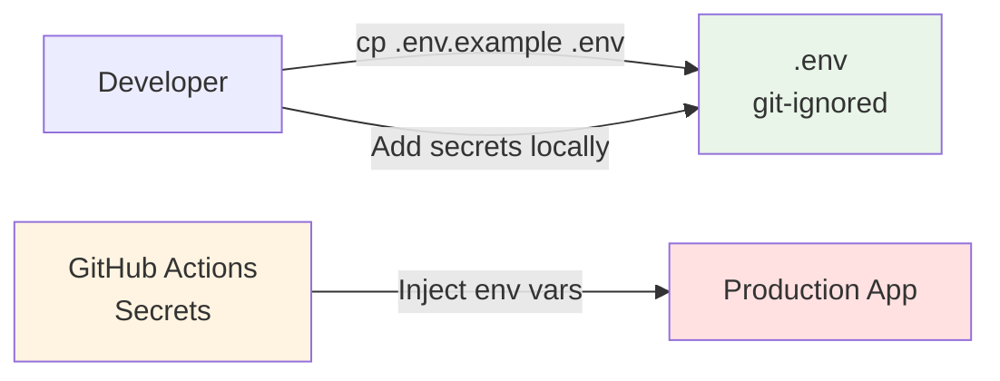

# Implementation Plan: Secure Secret Management

**Plan ID:** PLAN-002
**Sprint:** 1 (Critical)
**Effort:** S (1 dia)
**Priority:** CRITICAL (Security)
**Owner:** @dev
**Architect:** @architect (Aria)
**Created:** 2026-02-21

---

## 1. Overview

### 1.1 Objective
Implementar secret management seguro para proteger credenciais (DATAJUD_API_KEY, OPENROUTER_API_KEY, SENTRY_DSN) contra exposure acidental via commits git, garantindo compliance com security best practices.

### 1.2 Business Value
- **Security:** Elimina risco de credential leak (CRITICAL)
- **Compliance:** LGPD, security audits, SOC 2 readiness
- **Cost Avoidance:** Previne API key rotation emergencial ($0 → $500+)
- **Trust:** Protege dados de usuários e integridade do sistema

### 1.3 Success Criteria
- [ ] Secrets não commitados em git history
- [ ] `.gitignore` validado e completo
- [ ] Secrets encryptados em produção
- [ ] Rotation procedure documentado
- [ ] Team treinado em secret management

---

## 2. Technical Approach

### 2.1 Secret Management Strategy

**Development (Local):**
- `.env` files (git-ignored)
- Plaintext acceptable (local machine only)

**Staging/Production:**
- **Option A:** dotenv-vault (simples, custo médio)
- **Option B:** AWS Secrets Manager (enterprise, mais robusto)
- **Option C:** Environment variables via CI/CD (básico, adequado para MVP)

**Recommendation:** Start with **Option C** (env vars via CI/CD), migrate to **Option A** (dotenv-vault) quando CI/CD estiver implementado.

### 2.2 Architecture



---

## 3. Implementation Phases

### Phase 1: Audit Current State (30 min)

**Tasks:**

#### 1.1 Check Git History for Exposed Secrets
```bash
# Search for potential API keys in git history
cd "c:\Projetos\Consulta processo"

# Search for patterns
git log --all --full-history --source --pretty=format: -- .env | grep -E "API_KEY|SECRET|PASSWORD"

# Search for specific files
git log --all --oneline -- .env
git log --all --oneline -- backend/.env
```

**If secrets found in history:**
```bash
# Use BFG Repo-Cleaner to remove
# https://rtyley.github.io/bfg-repo-cleaner/

# 1. Clone fresh copy
git clone --mirror https://github.com/user/consulta-processo.git

# 2. Remove .env from history
bfg --delete-files .env consulta-processo.git

# 3. Force push (CAUTION: coordinate with team)
cd consulta-processo.git
git reflog expire --expire=now --all && git gc --prune=now --aggressive
git push --force
```

#### 1.2 Verify `.gitignore`
```bash
cat .gitignore | grep -E "\.env"
```

**Expected entries:**
```gitignore
# Environment variables
.env
.env.local
.env.*.local
backend/.env
frontend/.env
frontend/.env.local
frontend/.env.development.local
frontend/.env.production.local

# Sensitive configs
*.pem
*.key
*.crt
secrets/
```

**Action:** Add missing patterns if not present

#### 1.3 Identify All Secret Files
```bash
# Find all .env files
find . -name ".env*" -type f

# Expected output:
# ./.env
# ./backend/.env
# ./frontend/.env.development
# ./frontend/.env.production (se existe)
```

#### 1.4 Document Current Secrets Inventory

| Secret | Location | Purpose | Rotation Frequency |
|--------|----------|---------|-------------------|
| `DATAJUD_API_KEY` | backend/.env | DataJud API auth | Never (public API) |
| `OPENROUTER_API_KEY` | backend/.env | LLM validation (unused) | Quarterly |
| `SENTRY_DSN` (backend) | backend/.env | Error monitoring | Never (public DSN) |
| `SENTRY_DSN` (frontend) | frontend/.env | Error monitoring | Never (public DSN) |
| `DATABASE_URL` | backend/.env | SQLite path | N/A (local file) |

**Sensitive Secrets (require protection):**
- ❌ DATAJUD_API_KEY (if becomes auth-required in future)
- ✅ OPENROUTER_API_KEY (private API key)

**Public Secrets (DSNs):**
- ℹ️ SENTRY_DSN (public, safe to expose)

**Deliverable:** Audit report com status de cada secret

---

### Phase 2: Secure `.gitignore` (15 min)

**Tasks:**

#### 2.1 Update Root `.gitignore`
```gitignore
# === Environment Variables ===
.env
.env.local
.env.*.local
!.env.example

# Backend
backend/.env
backend/.env.local

# Frontend
frontend/.env
frontend/.env.local
frontend/.env.development.local
frontend/.env.production.local
!frontend/.env.development
!frontend/.env.production

# === Sensitive Files ===
# SSH keys
*.pem
*.key
*.crt
id_rsa
id_rsa.pub

# Database files (if sensitive)
*.db-wal
*.db-shm

# Secrets directory
secrets/
.secrets/

# === IDE/Tools ===
# VS Code settings (pode conter paths sensíveis)
.vscode/settings.json

# === Logs (podem conter dados sensíveis) ===
*.log
logs/
backend/*.log
backend_*.log
```

#### 2.2 Create `.env.example` Templates

**Root `.env.example`:**
```env
# ===========================================
# Consulta Processo - Environment Variables
# ===========================================
# IMPORTANT: Copy this file to .env and fill with real values
# NEVER commit .env to git

# === Application ===
ENVIRONMENT=development

# === Backend ===
# See backend/.env.example for backend-specific variables

# === Frontend ===
# See frontend/.env.example for frontend-specific variables
```

**Backend `.env.example`:**
```env
# ===========================================
# Backend Environment Variables
# ===========================================

# === Database ===
DATABASE_URL=sqlite:///./consulta_processual.db
DATABASE_ECHO=false

# === DataJud API ===
DATAJUD_API_KEY=your-api-key-here
DATAJUD_TIMEOUT=30
DATAJUD_BASE_URL=https://api-publica.datajud.cnj.jus.br

# === AI Integration (Optional) ===
OPENROUTER_API_KEY=sk-or-v1-your-key-here
AI_MODEL=google/gemini-2.0-flash-001

# === Error Monitoring ===
SENTRY_DSN=https://your-dsn@sentry.io/project-id
SENTRY_ENVIRONMENT=development
SENTRY_ENABLE=false

# === Security ===
ALLOWED_ORIGINS=http://localhost:5173
RATE_LIMIT_ENABLED=false
REQUIRE_AUTH=false

# === Logging ===
LOG_LEVEL=INFO
LOG_API_KEYS=false
DEBUG=true
```

**Frontend `.env.example`:**
```env
# ===========================================
# Frontend Environment Variables
# ===========================================

# === API Configuration ===
VITE_API_BASE_URL=/
VITE_API_TIMEOUT=30000

# === Error Monitoring ===
VITE_SENTRY_DSN=https://your-frontend-dsn@sentry.io/project-id
VITE_SENTRY_ENABLE=false
VITE_ENVIRONMENT=development

# === Debug ===
VITE_DEBUG=true
```

#### 2.3 Test `.gitignore` Effectiveness
```bash
# Create dummy .env with fake secrets
echo "DATAJUD_API_KEY=test123" > backend/.env.test

# Try to add to git
git add backend/.env.test

# Expected: warning "The following paths are ignored by one of your .gitignore files"
# If added, .gitignore is BROKEN

# Cleanup
rm backend/.env.test
```

**Files Modified:**
- `.gitignore` (update)
- `.env.example` (create)
- `backend/.env.example` (create)
- `frontend/.env.example` (create)

**Acceptance Criteria:**
- [ ] `.gitignore` blocks all `.env` files
- [ ] `.env.example` files committed (safe templates)
- [ ] Test confirms `.env` cannot be committed

---

### Phase 3: Rotate Exposed Secrets (if needed) (30 min)

**Tasks:**

#### 3.1 Check if Secrets Were Exposed in Git History

**If YES (found in Phase 1.1):**

**DATAJUD_API_KEY:**
- [ ] Verify if DataJud offers key rotation
- [ ] Generate new key (if possible)
- [ ] Update backend/.env
- [ ] Test integration com new key
- [ ] Revoke old key (if possible)

**OPENROUTER_API_KEY:**
- [ ] Log in to OpenRouter dashboard
- [ ] Generate new API key
- [ ] Update backend/.env
- [ ] Revoke old key
- [ ] Test (if being used)

**SENTRY_DSN:**
- [ ] DSNs são public-safe, rotação não necessária
- [ ] Mas considerar regenerar projeto se comprometido

#### 3.2 Document Rotation in CHANGELOG
```markdown
## [Security] Secret Rotation - 2026-02-21

**Reason:** Potential exposure in git history

**Actions Taken:**
- ✅ Rotated OPENROUTER_API_KEY
- ✅ Verified DATAJUD_API_KEY (public API, no rotation needed)
- ℹ️ SENTRY_DSN (public by design, no action needed)

**Impact:** None (rotated before exploitation)
```

**Acceptance Criteria:**
- [ ] All exposed secrets rotated
- [ ] New secrets tested and working
- [ ] Old secrets revoked
- [ ] Team notified of changes

---

### Phase 4: Setup Production Secret Management (1-2 horas)

**Tasks:**

#### 4.1 Choose Strategy (for future CI/CD)

**Option A: GitHub Actions Secrets (Recommended for MVP)**

```yaml
# .github/workflows/deploy.yml
env:
  DATAJUD_API_KEY: ${{ secrets.DATAJUD_API_KEY }}
  OPENROUTER_API_KEY: ${{ secrets.OPENROUTER_API_KEY }}
  SENTRY_DSN: ${{ secrets.SENTRY_DSN }}
```

**Setup:**
1. Go to GitHub repo → Settings → Secrets and variables → Actions
2. Add secrets:
   - `DATAJUD_API_KEY`
   - `OPENROUTER_API_KEY`
   - `SENTRY_DSN_BACKEND`
   - `SENTRY_DSN_FRONTEND`

**Pros:** Simple, free, integrated
**Cons:** Only accessible in CI/CD, não local dev

---

**Option B: dotenv-vault (Recommended for Team Environments)**

```bash
# Install
npm install -g dotenv-vault

# Initialize
cd backend
dotenv-vault new

# Push secrets (encrypted)
dotenv-vault push

# Team members pull
dotenv-vault pull
```

**Pros:** Encrypted at rest, team sync, versioned
**Cons:** $29/month (Team plan), requires CLI setup

---

**Option C: AWS Secrets Manager (Enterprise)**

```python
# backend/config.py
import boto3
from botocore.exceptions import ClientError

def get_secret(secret_name):
    client = boto3.client('secretsmanager', region_name='us-east-1')
    try:
        response = client.get_secret_value(SecretId=secret_name)
        return response['SecretString']
    except ClientError as e:
        raise e

class Settings(BaseSettings):
    DATAJUD_API_KEY: str = Field(default_factory=lambda: get_secret('datajud-api-key'))
```

**Pros:** Enterprise-grade, AWS integration, audit logs
**Cons:** Complexity, AWS account required, cost ($0.40/secret/month)

---

**Decision for Sprint 1:** Use **GitHub Actions Secrets** (Option A)
- Simple, zero cost
- Adequate for CI/CD pipeline
- Can migrate to dotenv-vault later se necessário

#### 4.2 Document Production Setup

Create `docs/operations/secret-management.md`:
```markdown
# Secret Management Guide

## Development (Local)

1. Copy `.env.example` to `.env`
2. Fill with real values (get from team lead)
3. **NEVER commit `.env` to git**

## Production (CI/CD)

Secrets managed via GitHub Actions Secrets:

### Adding New Secret
1. Go to repo → Settings → Secrets → Actions
2. Click "New repository secret"
3. Name: `SECRET_NAME`
4. Value: `secret-value`
5. Add (encrypted automatically)

### Accessing in Workflow
```yaml
env:
  SECRET_NAME: ${{ secrets.SECRET_NAME }}
```

## Rotation Procedure

### Quarterly Rotation (Scheduled)
- OPENROUTER_API_KEY: Q1, Q2, Q3, Q4

### Emergency Rotation
1. Generate new secret
2. Update GitHub Secrets
3. Deploy immediately
4. Revoke old secret
5. Document in CHANGELOG
```

**Acceptance Criteria:**
- [ ] Strategy escolhida e documentada
- [ ] GitHub Secrets configurados (se usando Option A)
- [ ] Team guide criado
- [ ] Rotation procedure definido

---

### Phase 5: Verification & Testing (30 min)

**Tasks:**

#### 5.1 Verify No Secrets in Git
```bash
# Run git-secrets (install if needed)
git secrets --scan

# Or use truffleHog
docker run --rm -it -v "$PWD:/proj" trufflesecurity/trufflehog:latest git file:///proj
```

#### 5.2 Test `.gitignore` with Force Add
```bash
# This SHOULD fail
git add -f backend/.env
# Expected: error or warning

# Check staged files
git status
# Expected: .env NOT listed
```

#### 5.3 Simulate New Developer Onboarding
```bash
# 1. Clone repo (fresh machine simulation)
git clone <repo-url> consulta-teste
cd consulta-teste

# 2. Copy .env.example
cp backend/.env.example backend/.env

# 3. Verify app doesn't start without secrets
cd backend
python -m uvicorn main:app --reload
# Expected: error about missing DATAJUD_API_KEY (if required)

# 4. Fill .env with dummy values
echo "DATAJUD_API_KEY=test123" >> backend/.env

# 5. Try to commit
git add backend/.env
# Expected: blocked by .gitignore
```

#### 5.4 Security Audit Checklist
- [ ] `.env` in `.gitignore`
- [ ] `.env.example` exists with safe defaults
- [ ] Git history clean (no secrets)
- [ ] GitHub Secrets configured (production)
- [ ] Team documented rotation procedure
- [ ] New developer guide tested

**Acceptance Criteria:**
- [ ] All tests pass
- [ ] No secrets committable to git
- [ ] Documentation complete
- [ ] Team trained

---

## 4. Rollback Plan

**If Issues Arise:**

### 4.1 Restore Previous `.gitignore`
```bash
git checkout HEAD~1 .gitignore
```

### 4.2 Emergency Secret Rotation
```bash
# If accidentally committed
1. Rotate ALL secrets immediately
2. Force push cleaned history (if early detection)
3. Notify team
```

**Rollback Time:** < 10 minutos (restore .gitignore)

---

## 5. Dependencies

### 5.1 External Dependencies
- [ ] Git installed
- [ ] GitHub repo access (for Secrets)
- [ ] Secret providers (OpenRouter, Sentry) dashboards access

### 5.2 Internal Dependencies
- [ ] Team coordination (rotation affects everyone)
- [ ] CI/CD pipeline (for production deployment) - **Future**

### 5.3 Blocking Dependencies
**None** - Can be implemented immediately

---

## 6. Risks & Mitigations

| Risk | Probability | Impact | Mitigation |
|------|------------|--------|------------|
| **Secret already leaked in git history** | MEDIUM | CRITICAL | Phase 1 audit + BFG cleanup + rotation |
| **Team commits .env accidentally** | MEDIUM | HIGH | Training + pre-commit hooks (future) |
| **Production secrets lost** | LOW | CRITICAL | Document backup procedure, use GitHub Secrets |
| **Rotation breaks production** | LOW | HIGH | Test rotation in staging first, rollback plan |

### 6.1 Pre-Commit Hook (Future Enhancement)

**Install git-secrets:**
```bash
# Prevents committing secrets
git secrets --install
git secrets --register-aws  # or custom patterns
```

**Custom pattern:**
```bash
git secrets --add 'DATAJUD_API_KEY=.*'
git secrets --add 'OPENROUTER_API_KEY=.*'
```

---

## 7. Post-Implementation

### 7.1 Documentation
- [ ] Update `README.md` com instruções .env setup
- [ ] Create `docs/operations/secret-management.md`
- [ ] Add rotation schedule to team calendar

### 7.2 Team Training
- [ ] Demo secret management workflow
- [ ] Emphasize NEVER commit .env
- [ ] Share rotation procedure

### 7.3 Monitoring
- [ ] Weekly git history scan (first month)
- [ ] Quarterly secret rotation (automated reminder)

---

## 8. Checklist Final

### Pre-Implementation
- [ ] Git history audited for secrets
- [ ] Secret inventory documented
- [ ] Team notified about upcoming changes

### Implementation
- [ ] `.gitignore` updated with comprehensive patterns
- [ ] `.env.example` files created (root, backend, frontend)
- [ ] Exposed secrets rotated (if any)
- [ ] Production secret strategy chosen and configured
- [ ] Documentation created

### Testing
- [ ] `.gitignore` effectiveness tested
- [ ] Git history clean (truffleHog scan)
- [ ] New developer onboarding simulated
- [ ] Security audit checklist completed

### Post-Implementation
- [ ] Team trained on secret management
- [ ] Rotation procedure scheduled (quarterly)
- [ ] Monitoring active (git-secrets or equivalent)

---

## 9. Timeline Estimate

| Phase | Duration | Dependencies |
|-------|----------|--------------|
| **Phase 1: Audit** | 30 min | None |
| **Phase 2: `.gitignore`** | 15 min | None |
| **Phase 3: Rotation** | 30 min | Phase 1 |
| **Phase 4: Production Setup** | 1-2 horas | GitHub access |
| **Phase 5: Verification** | 30 min | Phase 2, 3, 4 |
| **Total** | **3-4 horas** | |

**Effort Estimate:** S (1 dia including documentation and training)

---

**Plan Status:** ✅ Ready for Implementation
**Next Action:** Assign to @dev for execution
**Architect Approval:** @architect (Aria) - 2026-02-21
