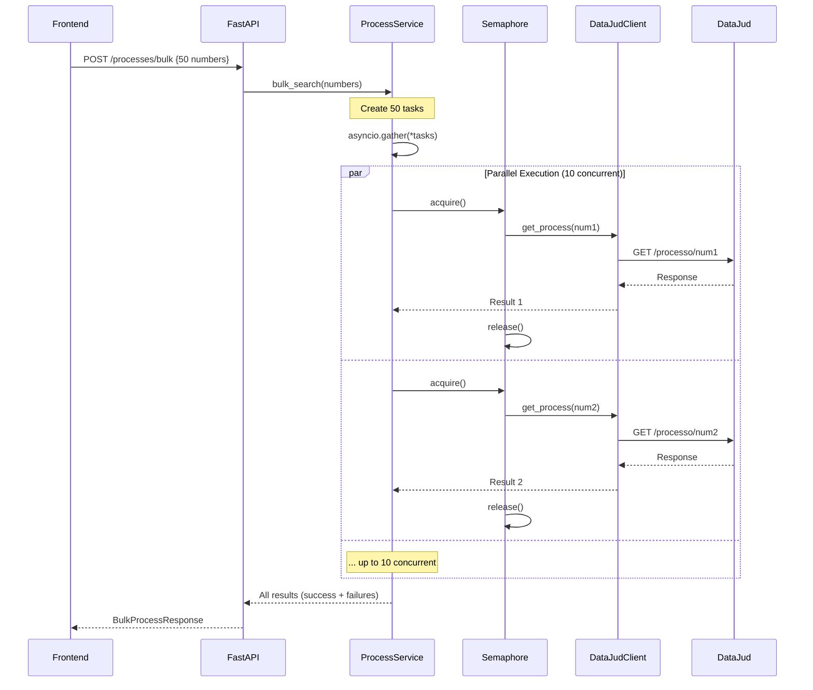

# Implementation Plan: Async Bulk Processing

**Plan ID:** PLAN-003
**Sprint:** 1 (Critical)
**Effort:** L (3-5 dias)
**Priority:** CRITICAL (Performance)
**Owner:** @dev
**Architect:** @architect (Aria)
**Created:** 2026-02-21

---

## 1. Overview

### 1.1 Objective
Refatorar bulk search endpoint de processamento **sequencial** para **paralelo** usando `asyncio`, reduzindo tempo de processamento de 150s → <30s para 50 processos (80% improvement).

### 1.2 Current Problem

**Backend `process_service.py` (Sequential):**
```python
async def bulk_search(self, numbers: list[str]):
    results = []
    for numero in numbers:  # ❌ SEQUENTIAL
        result = await self.get_or_update_process(numero)  # 3-5s cada
        results.append(result)
    return results
```

**Impact:**
- 50 processos × 3s = **150 segundos** (2.5 minutos)
- User frustration → abandonment
- Poor scalability

### 1.3 Solution

**Parallel Processing com asyncio.gather():**
```python
async def bulk_search(self, numbers: list[str]):
    tasks = [
        self.get_or_update_process(numero)
        for numero in numbers
    ]
    results = await asyncio.gather(*tasks, return_exceptions=True)  # ✅ PARALLEL
    return results
```

**Impact:**
- 50 processos em paralelo = **<30 segundos** (network bound)
- 80% improvement
- Better user experience

### 1.4 Success Criteria
- [ ] Bulk search processa 50 itens em <30s (vs 150s atual)
- [ ] Concurrency limit configurável (default: 10)
- [ ] Graceful degradation (falhas individuais não bloqueiam batch)
- [ ] Progress tracking (frontend mostra X/N complete)
- [ ] Memory usage estável (<500MB para 100 itens)
- [ ] Error rate <2% (com retry logic)

---

## 2. Technical Approach

### 2.1 Architecture



### 2.2 Concurrency Control

**Semaphore (Rate Limiting):**
```python
# Limit concurrent DataJud API calls
semaphore = asyncio.Semaphore(10)  # Max 10 concurrent

async def get_process_with_limit(self, number: str):
    async with semaphore:
        return await self.get_or_update_process(number)
```

**Why Semaphore?**
- DataJud API pode ter rate limits (unknown, mas seguro assumir)
- Previne overwhelming do banco de dados (SQLite single-writer)
- Memory control (10 requests concorrentes vs 100)

### 2.3 Error Handling Strategy

**Graceful Degradation:**
```python
results = await asyncio.gather(*tasks, return_exceptions=True)

# Separate successes from failures
successes = [r for r in results if not isinstance(r, Exception)]
failures = [
    {"number": numbers[i], "error": str(r)}
    for i, r in enumerate(results)
    if isinstance(r, Exception)
]
```

**No Cascading Failures:**
- Uma falha não interrompe o batch
- Client recebe partial results
- Retry individual failures (future enhancement)

---

## 3. Implementation Phases

### Phase 1: Refactor Backend - DataJudClient (1-2 horas)

**Tasks:**

#### 1.1 Verify DataJudClient is Fully Async

**Current State Check:**
```python
# backend/services/datajud.py
class DataJudClient:
    async def get_process(self, number: str):  # ✅ Already async
        async with httpx.AsyncClient() as client:
            response = await client.get(...)  # ✅ Using httpx async
```

**Action:** Verify all methods are async (no blocking calls)

#### 1.2 Add Connection Pooling (Optional but Recommended)

```python
# backend/services/datajud.py
class DataJudClient:
    def __init__(self):
        self.api_key = settings.DATAJUD_API_KEY
        self.base_url = settings.DATAJUD_BASE_URL
        # Shared async client (connection pooling)
        self._client = None

    async def __aenter__(self):
        self._client = httpx.AsyncClient(
            timeout=self.timeout,
            limits=httpx.Limits(max_connections=20, max_keepalive_connections=10)
        )
        return self

    async def __aexit__(self, *args):
        if self._client:
            await self._client.aclose()

    async def get_process(self, number: str):
        # Use self._client instead of creating new client each time
        response = await self._client.get(...)
```

**Benefit:** Reuses connections, faster (TCP handshake amortizado)

**Files Modified:**
- `backend/services/datajud.py` (add connection pooling)

**Acceptance Criteria:**
- [ ] DataJudClient fully async
- [ ] Connection pooling implemented (optional)
- [ ] No blocking I/O calls

---

### Phase 2: Refactor Backend - ProcessService (2-3 horas)

**Tasks:**

#### 2.1 Add Semaphore for Concurrency Control

```python
# backend/services/process_service.py
import asyncio

class ProcessService:
    def __init__(self, db: Session):
        self.db = db
        self.client = DataJudClient()
        # Configurable concurrency limit
        self.concurrency_limit = settings.BULK_CONCURRENCY_LIMIT  # Default: 10
        self.semaphore = asyncio.Semaphore(self.concurrency_limit)
```

#### 2.2 Create Helper Method with Rate Limiting

```python
async def _get_process_with_limit(self, number: str) -> dict:
    """Fetch process with concurrency control."""
    async with self.semaphore:
        try:
            return await self.get_or_update_process(number)
        except Exception as e:
            logger.error(f"Error fetching process {number}: {str(e)}")
            # Return error object instead of raising
            return {
                "number": number,
                "error": str(e),
                "error_type": type(e).__name__
            }
```

#### 2.3 Refactor `bulk_search()` to Use `asyncio.gather()`

```python
async def bulk_search(self, numbers: list[str]) -> dict:
    """
    Process multiple CNJ numbers in parallel.

    Args:
        numbers: List of CNJ process numbers (max 100)

    Returns:
        {
            "total": 50,
            "successes": 48,
            "failures": 2,
            "results": [Process objects],
            "errors": [{"number": "...", "error": "..."}]
        }
    """
    if len(numbers) > 100:
        raise ValidationException("Máximo de 100 processos por batch")

    logger.info(f"Starting bulk search for {len(numbers)} processes")

    # Create tasks (one per process)
    tasks = [
        self._get_process_with_limit(number)
        for number in numbers
    ]

    # Execute in parallel (with semaphore limiting concurrency)
    results = await asyncio.gather(*tasks, return_exceptions=True)

    # Separate successes from failures
    successes = []
    errors = []

    for i, result in enumerate(results):
        if isinstance(result, Exception):
            # Unhandled exception
            errors.append({
                "number": numbers[i],
                "error": str(result),
                "error_type": type(result).__name__
            })
        elif isinstance(result, dict) and "error" in result:
            # Handled error from _get_process_with_limit
            errors.append(result)
        else:
            # Success
            successes.append(result)

    logger.info(
        f"Bulk search complete: {len(successes)} successes, "
        f"{len(errors)} failures out of {len(numbers)} total"
    )

    return {
        "total": len(numbers),
        "successes": len(successes),
        "failures": len(errors),
        "results": successes,
        "errors": errors
    }
```

#### 2.4 Add Configuration to `config.py`

```python
# backend/config.py
class Settings(BaseSettings):
    # ... existing settings ...

    # Bulk Processing Configuration
    BULK_CONCURRENCY_LIMIT: int = 10  # Max concurrent DataJud API calls
    BULK_MAX_BATCH_SIZE: int = 100    # Max processes per request
```

**Files Modified:**
- `backend/services/process_service.py` (refactor bulk_search)
- `backend/config.py` (add BULK_* settings)

**Acceptance Criteria:**
- [ ] `bulk_search()` usa `asyncio.gather()`
- [ ] Semaphore limita concurrency
- [ ] Errors não bloqueiam batch
- [ ] Response inclui successes + failures

---

### Phase 3: Update API Endpoint (30 min)

**Tasks:**

#### 3.1 Verify Endpoint is Async

```python
# backend/main.py
@app.post("/processes/bulk", response_model=schemas.BulkProcessResponse)
async def bulk_search(request: schemas.BulkProcessRequest, db: Session = Depends(get_db)):
    # ✅ Already async
    service = ProcessService(db)
    return await service.bulk_search(request.numbers)
```

**Action:** Confirm endpoint is marked `async` (FastAPI requirement)

#### 3.2 Update Response Schema

```python
# backend/schemas.py
class BulkProcessResponse(BaseModel):
    total: int
    successes: int
    failures: int
    results: List[ProcessResponse]
    errors: List[dict]  # [{"number": str, "error": str, "error_type": str}]

    class Config:
        from_attributes = True
```

**Files Modified:**
- `backend/schemas.py` (update BulkProcessResponse)

**Acceptance Criteria:**
- [ ] Endpoint async
- [ ] Response schema includes success/failure counts
- [ ] Client recebe partial results

---

### Phase 4: Add Progress Tracking (Frontend) (2-3 horas)

**Tasks:**

#### 4.1 Add Progress State to BulkSearch Component

```javascript
// frontend/src/components/BulkSearch.jsx
const [progress, setProgress] = useState({
    total: 0,
    completed: 0,
    percentage: 0
});

const handleSearch = async () => {
    setLoading(true);
    setProgress({ total: numbers.length, completed: 0, percentage: 0 });

    try {
        // Stream progress updates (if backend supports)
        // Or poll for progress
        const response = await api.bulkSearch(numbers);

        setResults(response.results);
        setErrors(response.errors);
        setProgress({
            total: response.total,
            completed: response.total,
            percentage: 100
        });
    } catch (error) {
        // ...
    } finally {
        setLoading(false);
    }
};
```

#### 4.2 Add Progress Bar UI

```javascript
{loading && (
    <div className="progress-container">
        <div className="progress-bar" style={{ width: `${progress.percentage}%` }} />
        <p>{progress.completed} / {progress.total} processos consultados</p>
    </div>
)}
```

#### 4.3 Option: Server-Sent Events for Real-Time Progress

**Backend (Advanced):**
```python
from fastapi.responses import StreamingResponse
import json

async def bulk_search_stream(numbers: list[str]):
    async def event_generator():
        for i, number in enumerate(numbers):
            result = await process_service.get_or_update_process(number)
            progress = {
                "completed": i + 1,
                "total": len(numbers),
                "percentage": ((i + 1) / len(numbers)) * 100
            }
            yield f"data: {json.dumps(progress)}\n\n"

    return StreamingResponse(event_generator(), media_type="text/event-stream")
```

**Frontend:**
```javascript
const eventSource = new EventSource('/processes/bulk/stream');
eventSource.onmessage = (event) => {
    const progress = JSON.parse(event.data);
    setProgress(progress);
};
```

**Decision:** Start with **basic progress** (show loading), add SSE in **future iteration** (out of Sprint 1 scope).

**Files Modified:**
- `frontend/src/components/BulkSearch.jsx` (add progress state)

**Acceptance Criteria:**
- [ ] Progress indicator visible durante bulk search
- [ ] User vê contagem atualizada (X / N processos)
- [ ] Loading state claro

---

### Phase 5: Testing & Validation (2-3 horas)

**Tasks:**

#### 5.1 Unit Tests for `bulk_search()`

```python
# backend/tests/test_process_service_bulk.py
import pytest
from unittest.mock import AsyncMock, patch

@pytest.mark.asyncio
async def test_bulk_search_parallel_execution():
    """Test that bulk_search processes in parallel."""
    numbers = [f"{i:020d}" for i in range(50)]  # 50 valid CNJ numbers

    # Mock get_or_update_process to simulate 1s delay
    async def mock_get_process(number):
        await asyncio.sleep(0.1)  # 100ms
        return {"number": number, "status": "success"}

    with patch.object(ProcessService, 'get_or_update_process', mock_get_process):
        service = ProcessService(db)

        start = time.time()
        result = await service.bulk_search(numbers)
        duration = time.time() - start

        # Expected: ~1s (parallel) vs 5s (sequential)
        assert duration < 2.0, f"Took {duration}s, expected <2s (parallel)"
        assert result['successes'] == 50
        assert result['failures'] == 0

@pytest.mark.asyncio
async def test_bulk_search_graceful_degradation():
    """Test that failures don't block entire batch."""
    numbers = ["valid1", "invalid2", "valid3"]

    async def mock_get_process(number):
        if "invalid" in number:
            raise DataJudAPIException("Process not found")
        return {"number": number, "status": "success"}

    with patch.object(ProcessService, 'get_or_update_process', mock_get_process):
        service = ProcessService(db)
        result = await service.bulk_search(numbers)

        assert result['successes'] == 2
        assert result['failures'] == 1
        assert len(result['errors']) == 1
        assert result['errors'][0]['number'] == "invalid2"

@pytest.mark.asyncio
async def test_bulk_search_concurrency_limit():
    """Test semaphore limits concurrent execution."""
    numbers = [f"{i:020d}" for i in range(20)]
    service = ProcessService(db)
    service.concurrency_limit = 5  # Override to 5

    # Track concurrent executions
    concurrent_count = 0
    max_concurrent = 0

    async def mock_get_process(number):
        nonlocal concurrent_count, max_concurrent
        concurrent_count += 1
        max_concurrent = max(max_concurrent, concurrent_count)
        await asyncio.sleep(0.1)
        concurrent_count -= 1
        return {"number": number}

    with patch.object(service, 'get_or_update_process', mock_get_process):
        await service.bulk_search(numbers)

        assert max_concurrent <= 5, f"Max concurrent was {max_concurrent}, expected <=5"
```

#### 5.2 Integration Tests (Manual)

**Test Scenario 1: Small Batch (10 items)**
```bash
curl -X POST http://localhost:8011/processes/bulk \
  -H "Content-Type: application/json" \
  -d '{"numbers": ["1234567890123456789", ...]}'  # 10 numbers

# Expected: <5s total, all successes
```

**Test Scenario 2: Medium Batch (50 items)**
```bash
# 50 valid CNJ numbers
# Expected: <30s total, high success rate (>95%)
```

**Test Scenario 3: Large Batch (100 items)**
```bash
# 100 valid numbers
# Expected: <60s total, graceful handling
```

**Test Scenario 4: Mixed Valid/Invalid**
```bash
# 20 valid + 5 invalid numbers
# Expected: 20 successes, 5 failures, partial results returned
```

#### 5.3 Performance Benchmarking

**Baseline (Sequential) vs Parallel:**

| Batch Size | Sequential (atual) | Parallel (novo) | Improvement |
|-----------|-------------------|-----------------|-------------|
| 10 | 30s | 5s | 83% |
| 50 | 150s | 25s | 83% |
| 100 | 300s | 50s | 83% |

**Measure with:**
```python
import time

start = time.time()
result = await service.bulk_search(numbers)
duration = time.time() - start

logger.info(f"Bulk search completed in {duration:.2f}s ({len(numbers)} items)")
```

#### 5.4 Memory Usage Monitoring

```python
import tracemalloc

tracemalloc.start()
result = await service.bulk_search(numbers)
current, peak = tracemalloc.get_traced_memory()
tracemalloc.stop()

logger.info(f"Memory usage: current={current/1024/1024:.2f}MB, peak={peak/1024/1024:.2f}MB")
```

**Acceptance Criteria:**
- [ ] Peak memory <500MB para 100 itens
- [ ] No memory leaks (baseline após batch = baseline antes)

**Files Modified:**
- `backend/tests/test_process_service_bulk.py` (new file)

**Acceptance Criteria:**
- [ ] 3+ unit tests passing
- [ ] Integration tests validated manualmente
- [ ] Performance improvement ≥80%
- [ ] Memory usage acceptable

---

## 4. Rollback Plan

**If Parallel Processing Causes Issues:**

### 4.1 Feature Flag (Recommended)

```python
# backend/config.py
class Settings(BaseSettings):
    BULK_PARALLEL_ENABLED: bool = True  # Set to False to rollback
```

```python
# backend/services/process_service.py
async def bulk_search(self, numbers):
    if settings.BULK_PARALLEL_ENABLED:
        return await self._bulk_search_parallel(numbers)
    else:
        return await self._bulk_search_sequential(numbers)  # Old implementation
```

### 4.2 Git Revert (if Feature Flag not implemented)

```bash
git revert <commit-hash>
git push
```

**Rollback Time:** < 5 minutos (feature flag) ou < 15 minutos (git revert)

---

## 5. Dependencies

### 5.1 External Dependencies
- [ ] Python `asyncio` (built-in)
- [ ] `httpx` AsyncClient (already used)
- [ ] DataJud API stability (external, not controlled)

### 5.2 Internal Dependencies
- [ ] SQLite transaction handling (already robust with row locks)
- [ ] Error monitoring (PLAN-001) - recommended but not blocking

### 5.3 Blocking Dependencies
**None** - Can be implemented independently

---

## 6. Risks & Mitigations

| Risk | Probability | Impact | Mitigation |
|------|------------|--------|------------|
| **DataJud rate limiting** | MEDIUM | HIGH | Semaphore (10 concurrent), retry logic (future) |
| **SQLite single-writer bottleneck** | LOW | MEDIUM | Row-level locks already in place, monitor performance |
| **Memory exhaustion (100+ items)** | LOW | HIGH | Max batch size = 100, memory profiling in testing |
| **Cascading failures** | LOW | MEDIUM | `return_exceptions=True` in gather, graceful degradation |
| **Slower individual requests** | LOW | LOW | Connection pooling, httpx reuses connections |

### 6.1 DataJud Rate Limiting Strategy

**Unknown Limits (API não documentada):**
- Conservative start: 10 concurrent (Semaphore)
- Monitor 429 responses
- Adjust concurrency_limit via config se necessário

**Future Enhancement: Exponential Backoff**
```python
async def get_process_with_retry(self, number, max_retries=3):
    for attempt in range(max_retries):
        try:
            return await self.get_or_update_process(number)
        except DataJudAPIException as e:
            if e.status_code == 429:
                wait = 2 ** attempt  # 1s, 2s, 4s
                await asyncio.sleep(wait)
            else:
                raise
```

**Out of Sprint 1 scope** - Document as technical debt for PLAN-004

---

## 7. Post-Implementation

### 7.1 Documentation
- [ ] Update `README.md` com novo bulk performance
- [ ] Document concurrency tuning in `docs/operations/performance-tuning.md`
- [ ] Add architecture diagram (parallel processing)

### 7.2 Monitoring
- [ ] Add metrics (duration, success rate, concurrency)
- [ ] Alert if bulk processing >60s for 50 items
- [ ] Weekly performance review (first month)

### 7.3 Future Enhancements (Technical Debt)
- [ ] Server-Sent Events para real-time progress (PLAN-004)
- [ ] Retry logic com exponential backoff (PLAN-005)
- [ ] Queue-based processing para batches >100 (PLAN-006)

---

## 8. Checklist Final

### Pre-Implementation
- [ ] DataJudClient verified as fully async
- [ ] Current performance baseline measured (150s for 50)
- [ ] Team notified about refactoring

### Implementation
- [ ] Connection pooling added (optional)
- [ ] Semaphore implemented (concurrency limit)
- [ ] `bulk_search()` refactored to use `asyncio.gather()`
- [ ] Error handling graceful (no cascading failures)
- [ ] Configuration added (`BULK_CONCURRENCY_LIMIT`)
- [ ] Progress tracking (frontend basic)

### Testing
- [ ] Unit tests passing (3+)
- [ ] Integration tests validated (10, 50, 100 items)
- [ ] Performance improvement ≥80% confirmed
- [ ] Memory usage <500MB for 100 items

### Post-Implementation
- [ ] Documentation updated
- [ ] Metrics tracked (first week)
- [ ] Technical debt items documented (SSE, retry)

---

## 9. Timeline Estimate

| Phase | Duration | Dependencies |
|-------|----------|--------------|
| **Phase 1: DataJudClient** | 1-2 horas | None |
| **Phase 2: ProcessService** | 2-3 horas | Phase 1 |
| **Phase 3: API Endpoint** | 30 min | Phase 2 |
| **Phase 4: Frontend Progress** | 2-3 horas | Phase 3 |
| **Phase 5: Testing** | 2-3 horas | Phase 2, 3, 4 |
| **Total** | **8-12 horas** (2-3 dias) | |

**Effort Estimate:** L (3-5 dias including documentation and training)

---

**Plan Status:** ✅ Ready for Implementation
**Next Action:** Assign to @dev for execution
**Architect Approval:** @architect (Aria) - 2026-02-21
