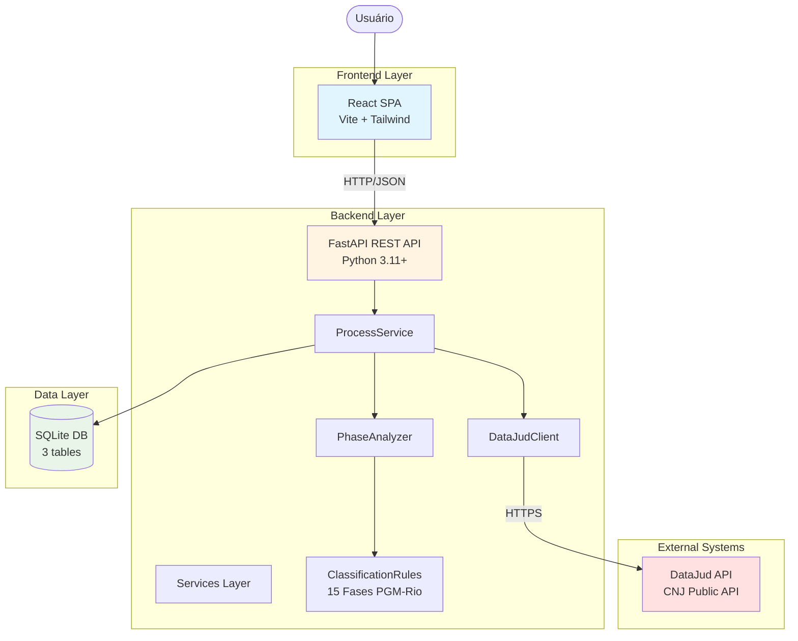
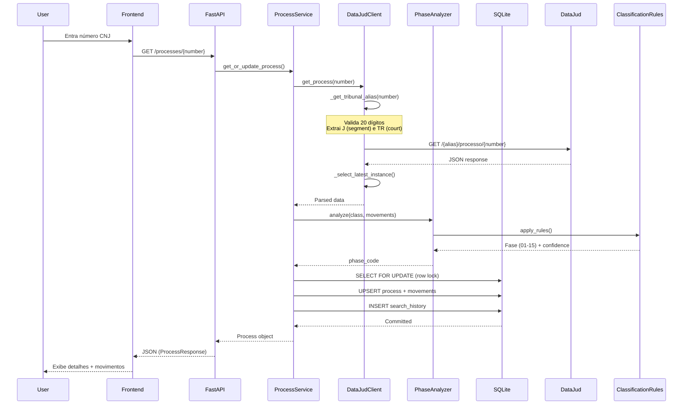
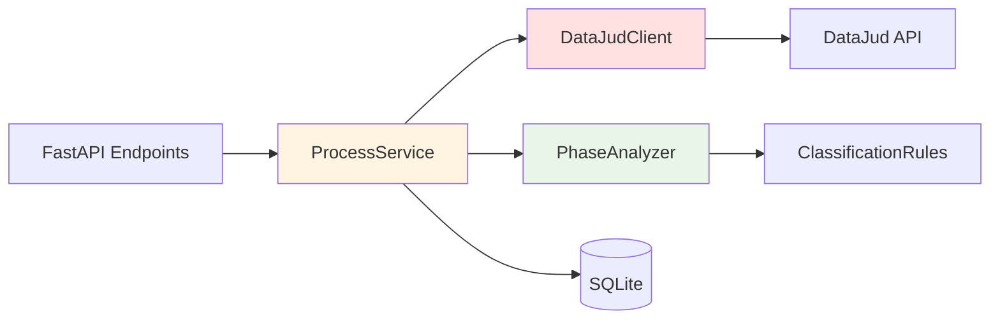
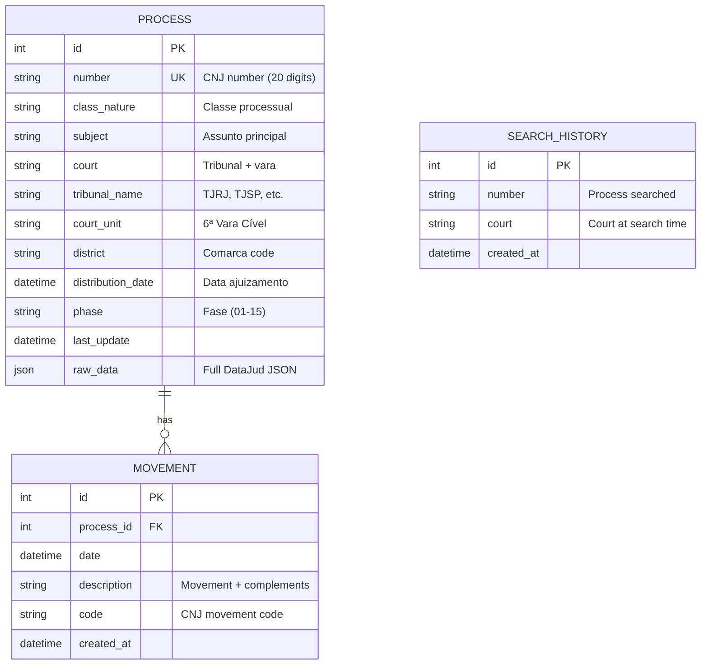
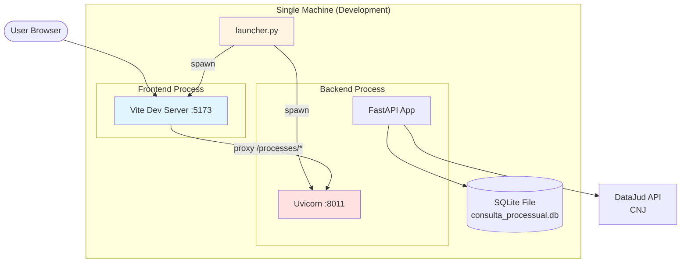

# System Architecture Assessment
**Projeto:** Consulta Processo
**Data de Avaliação:** 2026-02-21
**Avaliador:** @architect (Aria)
**Fase:** Brownfield Discovery - Fase 1
**Versão:** 1.0

---

## 1. Executive Summary

O **"Consulta Processo"** é uma aplicação web full-stack para consulta de processos judiciais brasileiros via integração com a API pública DataJud (CNJ). A arquitetura atual é **monolítica moderna** com separação clara entre camadas (frontend SPA, backend API REST, banco de dados relacional), seguindo padrões estabelecidos de desenvolvimento web.

### 1.1 Características Arquiteturais Principais

| Aspecto | Implementação |
|---------|---------------|
| **Padrão Arquitetural** | Monolito modular com separação frontend/backend |
| **Comunicação** | REST API (JSON over HTTP) |
| **Estado** | Stateless backend + database persistence |
| **Deployment** | Single-machine launcher (development/local) |
| **Escalabilidade** | Vertical scaling (otimizado para cargas pequenas-médias) |
| **Complexidade** | Média (integração externa + classificação determinística) |

### 1.2 Maturidade Arquitetural

**Strengths (Pontos Fortes):**
- ✅ Separação clara de responsabilidades (frontend, backend, services)
- ✅ Service Pattern bem implementado (DataJudClient, ProcessService)
- ✅ Transaction management com row-level locking
- ✅ Configuração centralizada (Pydantic Settings)
- ✅ Error handling estruturado (exceções customizadas)

**Opportunities (Oportunidades):**
- ⚠️ Ausência de async/await em operações I/O-bound (bulk processing)
- ⚠️ Acoplamento entre ProcessService e DataJudClient (injeção de dependência implícita)
- ⚠️ Dead code (OpenRouter configurado mas não utilizado)
- ⚠️ Deployment primitivo (launcher manual, sem CI/CD)
- ⚠️ Falta de observabilidade (sem monitoring, logging centralizado limitado)

---

## 2. Architecture Overview

### 2.1 Contexto e Propósito

O sistema foi desenvolvido para atender a necessidade de **gestão de acervo processual** e **análises macro** sobre processos judiciais. A arquitetura foi projetada para:

1. **Consultar** números de processo no formato CNJ (20 dígitos)
2. **Integrar** com a API pública do DataJud (CNJ) para obter dados oficiais
3. **Armazenar** localmente para cache e análises offline
4. **Analisar** e classificar automaticamente a fase processual (15 fases PGM-Rio)
5. **Exportar** dados estruturados em múltiplos formatos (CSV, XLSX, TXT, MD)

### 2.2 High-Level Architecture Diagram



### 2.3 Data Flow Diagram



---

## 3. Architecture Layers

### 3.1 Frontend Layer

**Tecnologia:** React 19.2.0 + Vite 7.2.4 + Tailwind CSS 3.4.1

**Responsabilidades:**
- Interface de usuário (busca individual/lote, visualização de detalhes)
- Gerenciamento de estado local (React Hooks, sem Redux)
- Comunicação com backend via Axios
- Export de dados (CSV, XLSX, TXT, Markdown)
- Acessibilidade (ARIA, semantic HTML)

**Estrutura:**
```
frontend/
├── src/
│   ├── components/          # 9 componentes React
│   │   ├── App.jsx          # Container principal (tabs navigation)
│   │   ├── SearchProcess.jsx
│   │   ├── BulkSearch.jsx
│   │   ├── ProcessDetails.jsx
│   │   ├── InstanceSelector.jsx
│   │   ├── Dashboard.jsx
│   │   └── Settings.jsx
│   ├── services/
│   │   └── api.js           # Axios client (12 endpoints)
│   ├── constants/
│   │   └── phases.js        # 15 fases processuais (normalization)
│   └── utils/
│       ├── phaseColors.js   # UI styling por fase
│       └── exportHelpers.js # CSV/XLSX generation
├── vite.config.js           # Proxy para backend
└── package.json
```

**Padrões Implementados:**
- **Component-based architecture**: Componentes focados em responsabilidade única
- **Prop drilling**: Estado passado via props (sem Context API)
- **Axios interceptors**: Logging e error handling centralizado
- **Tailwind utility-first CSS**: Design system ad-hoc (sem componentes base)

**Débitos Arquiteturais:**
- ⚠️ **FE-ARCH-001**: Prop drilling em 5+ níveis sem Context API (MEDIUM)
- ⚠️ **FE-ARCH-002**: Falta de design system componentizado (MEDIUM)
- ⚠️ **FE-ARCH-003**: Estado duplicado entre componentes (MEDIUM)

---

### 3.2 Backend Layer

**Tecnologia:** FastAPI 0.1.0 + Python 3.11+ + Pydantic

**Responsabilidades:**
- API REST (9 endpoints)
- Orquestração de dados (ProcessService)
- Integração com DataJud (DataJudClient)
- Classificação de fases (PhaseAnalyzer + ClassificationRules)
- Persistência transacional (SQLAlchemy ORM)
- Validação de schemas (Pydantic)

**Estrutura:**
```
backend/
├── main.py                  # FastAPI app + endpoints
├── config.py                # Pydantic Settings (centralizado)
├── database.py              # SQLAlchemy setup + transaction_scope
├── models.py                # ORM (Process, Movement, SearchHistory)
├── schemas.py               # Pydantic request/response
├── exceptions.py            # 5 custom exceptions
├── error_handlers.py        # FastAPI exception handlers
├── validators.py            # Input validation
└── services/
    ├── datajud.py           # DataJud API client (384 linhas)
    ├── process_service.py   # Orchestration (462 linhas)
    ├── phase_analyzer.py    # Adapter para classifier
    ├── classification_rules.py  # 15 regras determinísticas (743 linhas)
    ├── stats_service.py     # Database aggregations
    └── sql_integration_service.py
```

#### 3.2.1 API Endpoints

| Método | Endpoint | Descrição | Responsável |
|--------|----------|-----------|-------------|
| GET | `/health` | Health check | main.py |
| GET | `/processes/{number}` | Busca/atualiza processo | ProcessService |
| GET | `/processes/{number}/instances` | Lista instâncias (G1, G2, SUP) | ProcessService |
| GET | `/processes/{number}/instances/{index}` | Detalhes de instância específica | ProcessService |
| POST | `/processes/bulk` | Busca múltiplos processos | ProcessService |
| GET | `/stats` | Estatísticas do banco local | StatsService |
| POST | `/sql/test` | Testa conexão SQL externa | SQLIntegrationService |
| POST | `/sql/import` | Importa de SQL externo | SQLIntegrationService |
| GET | `/history` | Histórico de buscas | main.py |
| DELETE | `/history` | Limpa histórico | main.py |

#### 3.2.2 Service Layer Architecture

**Padrão:** Service Pattern com separação de responsabilidades



**ProcessService (Orquestrador):**
- Coordena DataJudClient + PhaseAnalyzer + Database
- Transaction management com `SELECT FOR UPDATE` (row-level locking)
- Fallback para cache local em caso de erro DataJud
- Registro de histórico de buscas

**DataJudClient (Integração Externa):**
- Validação de número CNJ (20 dígitos)
- Resolução inteligente de tribunal (alias baseado em J e TR)
- Suporte a múltiplas instâncias (G1, G2, Tribunais Superiores)
- Merge de resultados e seleção por `latest_movement_date`
- Retry logic com fallback (não implementado - **DÉBITO**)

**PhaseAnalyzer + ClassificationRules (Domain Logic):**
- Classificação determinística em 15 fases (PGM-Rio)
- Algoritmo de prioridade (baixa definitiva > sobrestamento > execução > instância)
- Confidence scores (0.60 a 0.95)
- Context generation para validação por LLM (**não utilizado - DÉBITO**)

**Débitos Arquiteturais:**
- ⚠️ **BE-ARCH-001**: Acoplamento forte ProcessService → DataJudClient (sem interface) (HIGH)
- ⚠️ **BE-ARCH-002**: Falta de retry logic com exponential backoff em DataJudClient (HIGH)
- ⚠️ **BE-ARCH-003**: Bulk processing sequencial em `bulk_search()` (CRITICAL)
- ⚠️ **BE-ARCH-004**: OpenRouter configurado mas não utilizado (dead code) (MEDIUM)

---

### 3.3 Data Layer

**Tecnologia:** SQLite 3 (local file-based)

**Schema:**



**Características:**
- **3 tabelas**: Process (core), Movement (1:N), SearchHistory (audit log)
- **Raw JSON storage**: `Process.raw_data` para auditoria e análise futura
- **Cascade delete**: Movements orphaned são deletados automaticamente
- **Indexes**: `Process.number` (unique), `Process.tribunal_name`, **faltam** indexes em Movement (⚠️)

**Transaction Management:**
```python
# backend/database.py
@contextmanager
def transaction_scope(db: Session):
    """Context manager para commit/rollback automático."""
    try:
        yield db
        db.commit()
    except Exception:
        db.rollback()
        raise

# backend/services/process_service.py
def _save_process_data(self, number, data):
    with transaction_scope(self.db):
        process = (
            self.db.query(Process)
            .filter(Process.number == number)
            .with_for_update()  # Row-level lock (previne race conditions)
            .first()
        )
        # ... UPSERT logic
```

**Débitos Arquiteturais:**
- ⚠️ **DB-ARCH-001**: Indexes faltantes em Movement (process_id, date, code) (HIGH)
- ⚠️ **DB-ARCH-002**: SQLite single-writer limitation para produção (MEDIUM)
- ⚠️ **DB-ARCH-003**: Falta de audit trail (change tracking) (MEDIUM)
- ⚠️ **DB-ARCH-004**: Sem estratégia de backup/recovery (HIGH)

---

### 3.4 External Integration: DataJud API

**Endpoint Base:** `https://api-publica.datajud.cnj.jus.br`

**Estratégia de Integração:**

#### 3.4.1 Tribunal Resolution Logic

A integração com DataJud requer resolução do **alias do tribunal** baseado no número CNJ:

**Formato CNJ:** `NNNNNNN-DD.AAAA.J.TR.OOOO`
- **J** (posição 13): Segmento judicial (3=Eleitoral, 4=Federal, 5=Trabalho, 6=Militar, 8=Estadual)
- **TR** (posições 14-15): Código do tribunal

**Algoritmo de Resolução:**
```python
def _get_tribunal_alias(process_number: str) -> str:
    j = clean[13]      # Judicial segment
    tr = clean[14:16]  # Tribunal code

    if j == "8":       # State Courts (TJ)
        return f"api_publica_tj{state_code}"  # Exemplo: tjrj, tjsp
    elif j == "4":     # Federal Courts (TRF 1-5)
        return f"api_publica_trf{tr}"
    elif j == "5":     # Labor Courts (TRT 1-24)
        return f"api_publica_trt{tr}"
    # ... + Electoral (3), Military (6)
    else:
        return "api_publica_cnj"  # Fallback genérico
```

#### 3.4.2 Multi-Instance Handling

DataJud pode retornar múltiplas instâncias do mesmo processo (1ª, 2ª, Tribunais Superiores).

**Estratégia Atual:**
1. Query tribunal principal + fallback CNJ API
2. Merge de resultados
3. Seleção por `latest_movement_date` (instância mais recente)
4. Metadata `__meta__` com aliases queried e instance count

**Exemplo:**
```json
{
  "hits": [
    {"grau": "G1", "tribunal": "TJRJ", "dataUltimaAtualizacao": "2024-06-01"},
    {"grau": "G2", "tribunal": "TJRJ", "dataUltimaAtualizacao": "2024-08-15"}
  ],
  "__meta__": {
    "aliases_queried": ["api_publica_tjrj", "api_publica_cnj"],
    "instances_count": 2,
    "source_grau": "G2"
  }
}
```

#### 3.4.3 Error Handling

| Erro | Código HTTP | Ação |
|------|------------|------|
| Processo não encontrado | 404 | Retorna None |
| Auth failure | 401 | DataJudAPIException |
| Rate limit | 429 | DataJudAPIException (sem retry - **DÉBITO**) |
| Server error | 500+ | DataJudAPIException + fallback cache local |
| Network timeout | - | Exception genérica + fallback cache |

**Débitos Arquiteturais:**
- ⚠️ **EXT-ARCH-001**: Sem retry com exponential backoff (429, 503) (HIGH)
- ⚠️ **EXT-ARCH-002**: Timeout fixo (30s) sem configuração por endpoint (MEDIUM)
- ⚠️ **EXT-ARCH-003**: Sem circuit breaker para proteger contra cascading failures (MEDIUM)

---

## 4. Technology Stack

### 4.1 Stack Decisions (from ADR)

| Layer | Technology | Versão | Rationale |
|-------|-----------|--------|-----------|
| **Backend Framework** | FastAPI | 0.1.0 | Nativo async/await, leve, auto-documentação OpenAPI |
| **Backend Language** | Python | 3.11+ | Análise de dados (Pandas), ecossistema rico |
| **HTTP Client** | httpx | latest | Async, API similar a requests |
| **ORM** | SQLAlchemy | latest | Mature, transaction support, migrations via Alembic |
| **Validation** | Pydantic | latest | Type-safe, auto serialization |
| **Database** | SQLite | 3 | Simple, file-based, **DIVERGÊNCIA** (ADR spec: PostgreSQL) |
| **Frontend Framework** | React | 19.2.0 | Component-based, large ecosystem |
| **Build Tool** | Vite | 7.2.4 | Fast HMR, modern bundler |
| **CSS Framework** | Tailwind CSS | 3.4.1 | Utility-first, rapid prototyping |
| **HTTP Client (FE)** | Axios | 1.13.4 | Interceptors, promise-based |

### 4.2 Architectural Decision Records (ADRs)

**ADRs Existentes:**
1. **decision-stack**: Python + FastAPI + React + ~~PostgreSQL~~ SQLite
2. **decision-integracao-datajud**: Service Pattern + httpx async + Pydantic

**Decisões Não Documentadas (a serem criadas):**
- Escolha por SQLite vs PostgreSQL (divergência do ADR original)
- Classificador determinístico vs LLM-based
- Launcher monolítico vs containerization
- Estado local (React Hooks) vs Redux/Context API

**Débitos Arquiteturais:**
- ⚠️ **ADR-ARCH-001**: Divergência entre ADR (PostgreSQL) e implementação (SQLite) não documentada (MEDIUM)
- ⚠️ **ADR-ARCH-002**: Decisões arquiteturais críticas sem ADR (deployment, state mgmt) (LOW)

---

## 5. Architectural Patterns

### 5.1 Backend Patterns

#### 5.1.1 Service Pattern
**Implementação:** `ProcessService`, `DataJudClient`, `StatsService`

**Características:**
- Separação de lógica de negócio dos endpoints
- Encapsulamento de integrações externas
- Testabilidade (mock de services)

**Exemplo:**
```python
class ProcessService:
    def __init__(self, db: Session):
        self.db = db
        self.client = DataJudClient()  # ⚠️ Acoplamento direto

    async def get_or_update_process(self, number: str):
        api_data = await self.client.get_process(number)
        return self._save_process_data(number, api_data)
```

#### 5.1.2 Repository Pattern (Parcial)
**Implementação:** Métodos de acesso a dados em `ProcessService`

**Nota:** Não há separação explícita de Repository layer. SQLAlchemy ORM é usado diretamente nos services.

**Débito:**
- ⚠️ **PATTERN-ARCH-001**: Falta de Repository abstraction (MEDIUM)

#### 5.1.3 Transaction Management
**Implementação:** Context manager `transaction_scope()` com auto commit/rollback

```python
@contextmanager
def transaction_scope(db: Session):
    try:
        yield db
        db.commit()
    except Exception:
        db.rollback()
        raise
```

**Row-Level Locking:**
```python
process = (
    db.query(Process)
    .filter(Process.number == number)
    .with_for_update()  # Previne race conditions
    .first()
)
```

#### 5.1.4 Exception Hierarchy
**Implementação:** 5 exceções customizadas em `exceptions.py`

```
DataJudAPIException (503)
InvalidProcessNumberException (400)
ProcessNotFoundException (404)
DataIntegrityException (409)
ValidationException (400)
```

**Exception Handlers:** Centralizados em `error_handlers.py` + registrados no FastAPI app

### 5.2 Frontend Patterns

#### 5.2.1 Component-Based Architecture
**Implementação:** 9 componentes React com responsabilidades focadas

**Hierarquia:**
```
App (container)
├── SearchProcess (busca individual)
├── BulkSearch (busca lote)
├── Dashboard (analytics)
├── HistoryTab (histórico)
└── Settings (configurações)

ProcessDetails (visualização)
├── InstanceSelector (troca instância)
└── PhaseReference (legenda fases)

ErrorBoundary (error handling)
```

#### 5.2.2 State Management
**Implementação:** React Hooks (useState, useEffect) + prop drilling

**Débito:**
- ⚠️ **PATTERN-ARCH-002**: Prop drilling profundo sem Context API (MEDIUM)

#### 5.2.3 API Abstraction
**Implementação:** Axios client centralizado (`services/api.js`) com 12 funções

```javascript
export const searchProcess = async (number) => {
    const response = await api.get(`/processes/${number}`);
    return response.data;
};
```

**Interceptors:**
- Request: Logging em debug mode
- Response: Error handling centralizado

---

## 6. Cross-Cutting Concerns

### 6.1 Configuration Management

**Implementação:** Pydantic Settings com `.env` file

```python
class Settings(BaseSettings):
    DATABASE_URL: str = "sqlite:///./consulta_processual.db"
    DATAJUD_API_KEY: str = ""
    DATAJUD_TIMEOUT: int = 30
    OPENROUTER_API_KEY: str = ""  # ⚠️ Não utilizado
    AI_MODEL: str = "google/gemini-2.0-flash-001"

    model_config = SettingsConfigDict(env_file=".env")
```

**Débitos:**
- ⚠️ **CONFIG-ARCH-001**: Secrets em .env sem encryption (CRITICAL - Security)
- ⚠️ **CONFIG-ARCH-002**: Configuração OpenRouter não utilizada (MEDIUM - Dead code)

### 6.2 Logging

**Implementação:** Python `logging` module com níveis configuráveis

```python
logger = logging.getLogger(__name__)
logger.warning(f"DataJud API error: {e.message}")
logger.error(f"Unexpected error: {str(e)}")
```

**Níveis:** Configurável via `LOG_LEVEL` (default: INFO)

**Débitos:**
- ⚠️ **LOG-ARCH-001**: Logging não estruturado (sem JSON, context) (MEDIUM)
- ⚠️ **LOG-ARCH-002**: Sem logging centralizado (aplicação + errors) (HIGH)
- ⚠️ **LOG-ARCH-003**: Frontend errors não capturados sistematicamente (MEDIUM)

### 6.3 Error Handling

**Backend:**
- Exception hierarchy customizada
- Handlers centralizados (FastAPI)
- HTTP status codes apropriados

**Frontend:**
- ErrorBoundary (React class component)
- Toast notifications (react-hot-toast)
- Axios interceptors

**Débitos:**
- ⚠️ **ERROR-ARCH-001**: ErrorBoundary não captura erros async ou event handlers (MEDIUM)
- ⚠️ **ERROR-ARCH-002**: Sem error tracking centralizado (Sentry, Rollbar) (CRITICAL)

### 6.4 Security

**Implementação Atual:**
- CORS configurado (`ALLOWED_ORIGINS`)
- Input validation (Pydantic)
- SQL injection prevention (ORM apenas)
- HTTPS para DataJud API

**Débitos:**
- 🔴 **SEC-ARCH-001**: Secrets em .env plaintext sem .gitignore verification (CRITICAL)
- ⚠️ **SEC-ARCH-002**: Rate limiting desabilitado (HIGH)
- ⚠️ **SEC-ARCH-003**: Authentication desabilitada por padrão (HIGH)
- ⚠️ **SEC-ARCH-004**: Sem HTTPS enforcement (local only, mas produção?) (MEDIUM)

### 6.5 Performance

**Otimizações Implementadas:**
- Transaction management com row locks
- Cache local (fallback para DB se API falhar)
- Raw JSON storage para evitar re-parsing

**Débitos:**
- 🔴 **PERF-ARCH-001**: Bulk processing sequencial (CRITICAL)
- ⚠️ **PERF-ARCH-002**: Indexes faltantes em Movement table (HIGH)
- ⚠️ **PERF-ARCH-003**: Sem caching layer (Redis, Memcached) (MEDIUM)
- ⚠️ **PERF-ARCH-004**: Frontend sem code splitting ou lazy loading (MEDIUM)

### 6.6 Testing

**Implementação:**
- Backend: 8 arquivos de teste (pytest)
- Frontend: 1 arquivo (`phases.test.js`)

**Cobertura:** ~15% backend, ~2% frontend (estimado)

**Débitos:**
- 🔴 **TEST-ARCH-001**: Cobertura de testes inadequada (<20%) (CRITICAL)
- ⚠️ **TEST-ARCH-002**: Testes desatualizados (anomalia fase 15) (HIGH)
- ⚠️ **TEST-ARCH-003**: Sem testes de integração end-to-end (HIGH)

---

## 7. Deployment Architecture

### 7.1 Current Deployment: Launcher-Based

**Implementação:** Script Python (`launcher.py`) que orquestra backend + frontend

```python
class ConsultaProcessualLauncher:
    def __init__(self):
        self.backend_port = self._find_available_port(8011)
        self.frontend_port = self._find_available_port(5173)

    def start(self):
        # 1. Check Python + Node.js
        # 2. Install dependencies (npm, pip)
        # 3. Start backend: uvicorn main:app --port {backend_port}
        # 4. Start frontend: npm run dev (port {frontend_port})
        # 5. Open browser
```

**Características:**
- ✅ Simples para desenvolvimento local
- ✅ Detecção automática de ports disponíveis
- ✅ Instalação de dependências automática
- ❌ Não adequado para produção
- ❌ Sem health checks ou restart automático
- ❌ Processos filhos não gerenciados adequadamente

### 7.2 Deployment Diagram



### 7.3 Deployment Débitos

- 🔴 **DEPLOY-ARCH-001**: Sem containerization (Docker) (HIGH)
- 🔴 **DEPLOY-ARCH-002**: Sem CI/CD pipeline (HIGH)
- ⚠️ **DEPLOY-ARCH-003**: Sem process manager (PM2, systemd) (HIGH)
- ⚠️ **DEPLOY-ARCH-004**: Sem health checks ou monitoring (CRITICAL)
- ⚠️ **DEPLOY-ARCH-005**: Sem estratégia de rollback (MEDIUM)
- ⚠️ **DEPLOY-ARCH-006**: Frontend dev server em produção (se usado) (CRITICAL)

---

## 8. Architectural Debits Summary

### 8.1 Critical Debits (Immediate Action Required)

| ID | Category | Description | Impact | Effort |
|----|----------|-------------|--------|--------|
| **SEC-ARCH-001** | Security | Secrets em .env plaintext | Security breach risk | S (1 day) |
| **PERF-ARCH-001** | Performance | Bulk processing sequencial | Poor UX (2-5min delays) | L (3-5 days) |
| **TEST-ARCH-001** | Quality | Cobertura <20% | Regression risk | XL (2 weeks) |
| **ERROR-ARCH-002** | Operations | Sem error monitoring | Blind to production issues | M (3-5 days) |
| **DEPLOY-ARCH-004** | Operations | Sem health checks/monitoring | Downtime não detectado | M (3-5 days) |

### 8.2 High Priority Debits

| ID | Category | Description | Effort |
|----|----------|-------------|--------|
| **BE-ARCH-001** | Code Quality | Acoplamento ProcessService → DataJudClient | M |
| **BE-ARCH-002** | Resilience | Sem retry logic com backoff | S |
| **DB-ARCH-001** | Performance | Indexes faltantes em Movement | XS |
| **DB-ARCH-004** | Operations | Sem backup/recovery strategy | M |
| **LOG-ARCH-002** | Operations | Logging não centralizado | M |
| **SEC-ARCH-002** | Security | Rate limiting desabilitado | S |
| **SEC-ARCH-003** | Security | Authentication desabilitada | M |
| **DEPLOY-ARCH-001** | Operations | Sem containerization | L |
| **DEPLOY-ARCH-002** | Operations | Sem CI/CD pipeline | L |
| **TEST-ARCH-002** | Quality | Testes desatualizados | M |

### 8.3 Medium Priority Debits

| ID | Category | Description | Effort |
|----|----------|-------------|--------|
| **FE-ARCH-001** | Code Quality | Prop drilling sem Context API | M |
| **FE-ARCH-002** | Code Quality | Sem design system componentizado | L |
| **BE-ARCH-004** | Code Quality | OpenRouter dead code | S |
| **DB-ARCH-002** | Scalability | SQLite single-writer limitation | XL |
| **DB-ARCH-003** | Compliance | Sem audit trail | M |
| **ADR-ARCH-001** | Governance | Divergência ADR vs implementação | XS |
| **PATTERN-ARCH-001** | Code Quality | Sem Repository abstraction | M |
| **PATTERN-ARCH-002** | Code Quality | Prop drilling profundo | M |
| **LOG-ARCH-001** | Operations | Logging não estruturado | S |
| **PERF-ARCH-003** | Performance | Sem caching layer | L |
| **EXT-ARCH-001** | Resilience | Sem retry com exponential backoff | S |
| **EXT-ARCH-002** | Configuration | Timeout fixo sem config | XS |
| **EXT-ARCH-003** | Resilience | Sem circuit breaker | M |

### 8.4 Low Priority Debits

| ID | Category | Description | Effort |
|----|----------|-------------|--------|
| **ADR-ARCH-002** | Governance | Decisões sem ADR | S |
| **FE-ARCH-003** | Code Quality | Estado duplicado entre componentes | M |
| **PERF-ARCH-004** | Performance | Sem code splitting (frontend) | M |

---

## 9. Architecture Strengths (Preserve)

### 9.1 Technical Strengths

1. **Deterministic Phase Classifier**
   - 15 regras bem definidas (PGM-Rio)
   - Confidence scores
   - Testável e auditável
   - **Recomendação:** Manter e expandir testes

2. **Service Pattern Bem Implementado**
   - Separação clara de responsabilidades
   - DataJudClient encapsula complexidade de integração
   - **Recomendação:** Adicionar interfaces para dependency injection

3. **Transaction Management Robusto**
   - Row-level locking com `SELECT FOR UPDATE`
   - Context manager para auto commit/rollback
   - **Recomendação:** Documentar e usar como padrão

4. **Intelligent Tribunal Resolution**
   - Algoritmo de mapeamento J/TR → alias
   - Fallback para CNJ genérico
   - **Recomendação:** Adicionar cache de resolução

5. **Multi-Instance Handling**
   - Merge de instâncias G1, G2, SUP
   - Seleção por data mais recente
   - **Recomendação:** Documentar lógica de merge

6. **Acessibilidade Frontend**
   - ARIA labels, semantic HTML
   - Skip links, keyboard navigation
   - **Recomendação:** Completar WCAG 2.1 AA compliance

7. **Export Multi-Formato**
   - CSV, XLSX, TXT, Markdown
   - Valor agregado para usuários
   - **Recomendação:** Manter e expandir

### 9.2 Architectural Strengths

1. **Monolito Modular**
   - Simples de entender e deployar
   - Apropriado para escala atual
   - **Recomendação:** Não migrar para microservices prematuramente

2. **Separation of Concerns**
   - Frontend/Backend/Database bem separados
   - Service layer isolado
   - **Recomendação:** Reforçar com interfaces explícitas

3. **Configuration Management**
   - Pydantic Settings centralizado
   - Type-safe
   - **Recomendação:** Adicionar secret management

---

## 10. Recommendations

### 10.1 Immediate Actions (Sprint 1 - CRITICAL)

1. **Implement Error Monitoring**
   - Integrar Sentry (backend + frontend)
   - Alertas para erros CRITICAL
   - **Effort:** M (3-5 dias)

2. **Secure Secret Management**
   - Audit .gitignore
   - Implementar dotenv-vault ou AWS Secrets Manager
   - Rodar secrets em produção
   - **Effort:** S (1 dia)

3. **Fix Async Bulk Processing**
   - Implementar `asyncio.gather()` em bulk_search
   - Concurrency limit configurável (default: 10)
   - **Effort:** L (3-5 dias)

### 10.2 Short-Term (Sprint 2-3 - HIGH)

4. **Add Database Indexes**
   - `CREATE INDEX idx_movement_process_date ON movement(process_id, date DESC);`
   - `CREATE INDEX idx_movement_code ON movement(code);`
   - **Effort:** XS (2 horas)

5. **Implement Retry Logic**
   - Exponential backoff para 429, 503
   - Max retries configurável
   - **Effort:** S (1 dia)

6. **Improve Test Coverage**
   - Target: 70% backend, 60% frontend
   - Priorizar ProcessService, DataJudClient, PhaseAnalyzer
   - **Effort:** XL (2 semanas)

7. **Decouple ProcessService from DataJudClient**
   - Introduzir interface `IDataJudClient`
   - Dependency injection explícita
   - **Effort:** M (3 dias)

### 10.3 Medium-Term (Sprint 4+ - MEDIUM)

8. **Implement Context API**
   - Eliminar prop drilling
   - Global state para user, settings, etc.
   - **Effort:** M (3-5 dias)

9. **Setup CI/CD Pipeline**
   - GitHub Actions ou equivalente
   - Automated testing + deployment
   - **Effort:** L (1 semana)

10. **Containerize Application**
    - Docker + docker-compose
    - Multi-stage builds
    - **Effort:** M (3-5 dias)

11. **Remove Dead Code**
    - OpenRouter integration não utilizada
    - Cleanup config
    - **Effort:** S (1 dia)

### 10.4 Long-Term (Backlog - LOW/FUTURE)

12. **Migrate to PostgreSQL** (only if scale demands)
    - Current SQLite adequate for <5k requests/day
    - Monitor, revisit threshold
    - **Effort:** XL (3-4 semanas)

13. **Implement Caching Layer**
    - Redis para cache de processos frequentes
    - TTL configurável
    - **Effort:** L (1 semana)

14. **Build Design System**
    - Componentizar Button, Input, Card, Modal
    - Storybook documentation
    - **Effort:** XL (2-3 semanas)

---

## 11. Conclusion

O projeto **"Consulta Processo"** possui uma **arquitetura sólida** com padrões estabelecidos e separação clara de responsabilidades. A implementação demonstra compreensão de boas práticas (Service Pattern, transaction management, acessibilidade) e resolve efetivamente o problema de negócio proposto.

**Principais Forças:**
- Integração DataJud robusta com resolução inteligente de tribunais
- Classificador de fases determinístico (15 regras PGM-Rio)
- Frontend acessível com export multi-formato
- Transaction management com row-level locking

**Principais Oportunidades:**
- **Performance:** Bulk processing sequencial (CRITICAL)
- **Operations:** Falta de monitoring e logging centralizado (CRITICAL)
- **Security:** Secrets management inadequado (CRITICAL)
- **Quality:** Cobertura de testes <20% (CRITICAL)
- **Deployment:** Launcher primitivo, sem CI/CD (HIGH)

**Próximo Passo:**
Fase 2 do Brownfield Discovery com **@data-engineer** para auditoria detalhada de database (schema, indexes, performance).

---

**Arquivo criado por:** @architect (Aria)
**Data:** 2026-02-21
**Revisão:** Pendente (@data-engineer, @ux-design-expert, @qa)
